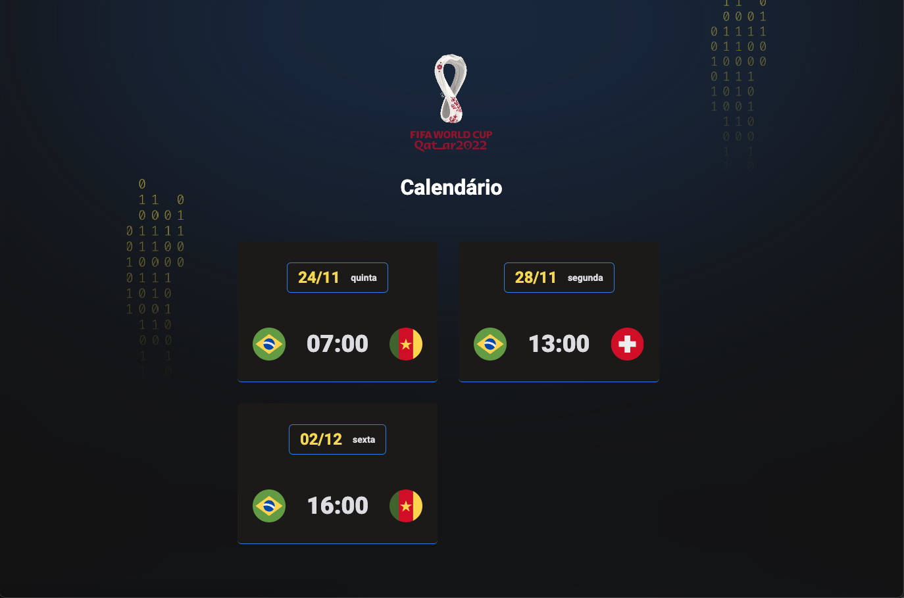

<h1 aling="center"> Calendário da copa de 2022 </h1>

 Evento exclusivo e gratuito, promovido pela Rocketseat para ensino de tecnoligia WEB. 

 

> Trilha Explorer

Projeto contruido no evento Next Level da Rocketseat

## Tecnologias 

Esse projeto foi desenvolvido com as seguintes tecnologias:

- HTML e CSS
- JavaScript
- Git e Github

## Projeto

O calendário da Copa é um projeto que mostra os jogos da Copa de 2022.

## :memo: Licença

Esse projeto está sob a licença MIT.